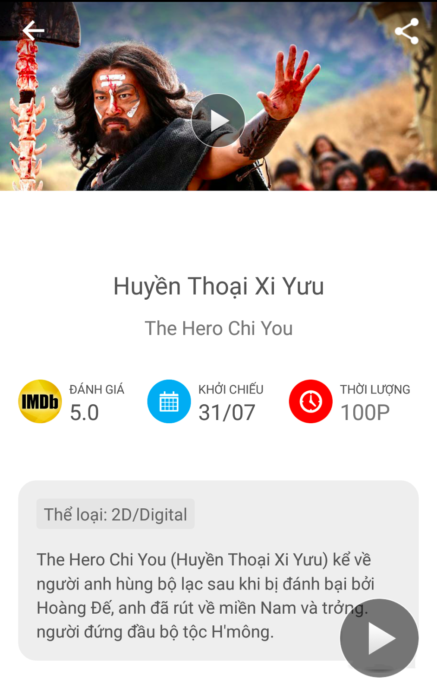

This test is designed for students who haven't learnt Android before or just know little things about Android.

**Duration: 1 week.**

## Requirements:
* Replicate the UI of a well-known app.

* The whole screen is scrollable (if the description is too long).
* This icon at the bottom right corner of the screen should not be hidden if user scrolls down or up.
* All movie's info is fake.
* You can choose any image to be the movie poster.
* All the icons can be downloaded from here: [icons.zip](images/entrance/test1/assets.zip)

## References
* Setup Environment: [Setup](Before_started.md)
* [Creating your first Android apps](http://developer.android.com/training/basics/firstapp/creating-project.html)
