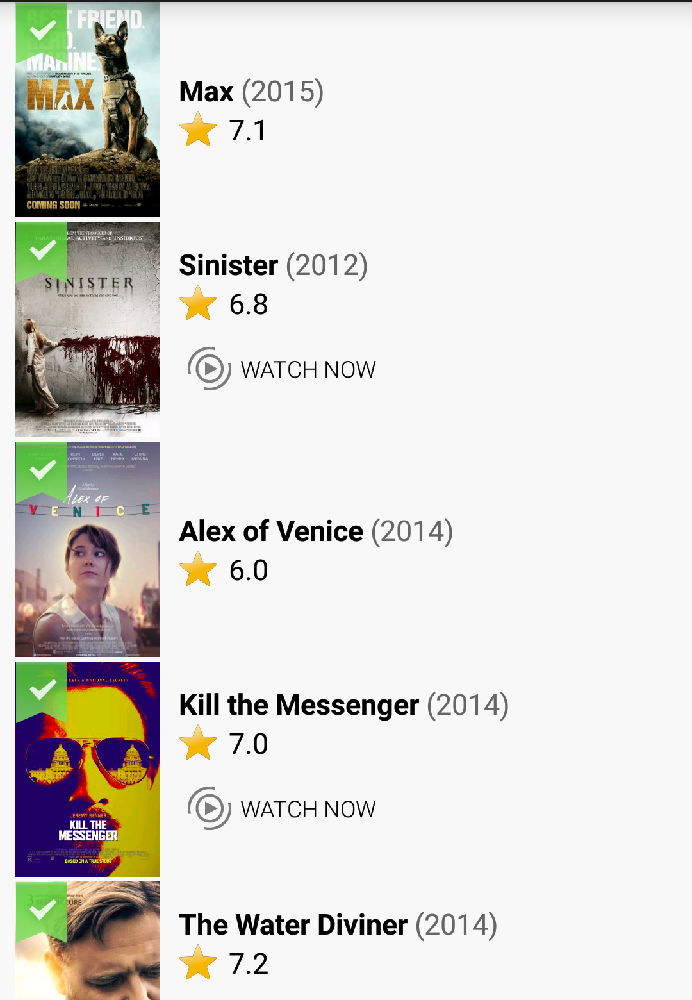

This test is designed for students who have learnt Android before.
**Duration: 1 week.**

## Requirements:
* Given a list of movies inside a [json file](http://www.jsoneditoronline.org/?id=cf1aa6688e41639e52b7b3fc4fbf1331), display that list of movies inside an Android app.
* Checkout the skeleton code at: https://github.com/jupitervn/Android_EntranceTest2/tree/master
* Each movie will be represented as a json object inside a json array. Example:
```
{
id: 76341,
original_language: "en",
original_title: "Mad Max: Fury Road",
overview: "...",
release_date: "2015-05-15",
poster_path: "/kqjL17yufvn9OVLyXYpvtyrFfak.jpg",
popularity: 52.43451,
title: "Mad Max: Fury Road",
video: false,
vote_average: 7.8,
vote_count: 1418
...
}
```

#### Notes:
* Image url of the movie poster will be constructed in this way: `http://image.tmdb.org/t/p/w154/{poster_path}` (ex: http://image.tmdb.org/t/p/w154/kqjL17yufvn9OVLyXYpvtyrFfak.jpg)
* The release date of the movie will be in this format `yyyy-MM-dd`.
* `vote_average` is the rating of the movie.

* Implements the UI below in an activity named `MovieListActivity`



* The title of the movie must be bold and we use `original_title` value, the movie name should be displayed in one line. If the name is too long, truncate the last part with “...”.
* Tapping on each item will show the  icon at the top left corner of movie’s poster. Tap on that item again will hide this icon. When user first comes to this screen, all items will be in **unselected** state.
* `WATCH NOW` label will only be shown if the movie has been released for over 3 months (use {release_date} field for this checking).
* Provided icons can be downloaded from [here](images/entrance/test2/icons.zip)

> Bonus:
>
> Show an edit text at the top of the list above, typing on the edit text will filter the movies list based on name.


## References
* Setup Environment: [Setup](Before_started.md)
* How to use listview:  http://www.vogella.com/tutorials/AndroidListView/article.html
