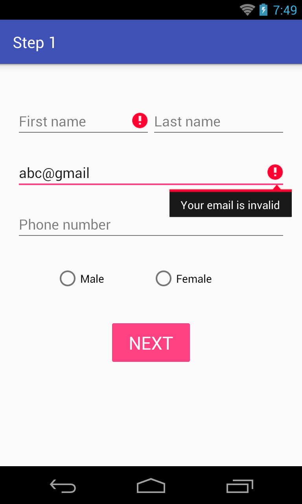

# Handle UI controls event
------
## Objectives:
* Learn how to handle UI controls event for simple input controls: EditText, Button, SeekBar, RadioButton, CheckBox
* Learn how to start a new activity from a current one.

## `SignUpStep1Activity` requirements:
* Press `NEXT` button should open SignUpStep2Activity.
* Some validations needs to be performed before going to Step2
    + `FirstName` and `LastName` should not be emptied.
    + `Email` should be valid (some invalid cases: abc@gmail, abc@, abc, gmail.com...)
    + `Phone Number` should be valid.
* If one of the validations above is violated then the message should be shown like below:

    + Textfield is emptied then show: "You must enter {textfield}" with {textfield} are "FirstName", "LastName", "Email", "PhoneNumber"
    + Textfield is invalid then show: "Email is invalid" or "PhoneNumber is invalid"

## `SignUpStep2Activity` requirements:
* When user change the value of `Salary` seekbar, the label above is also updated with the following text "Your salary: {x} dollars".
* User must select one kind of sports before presses 'DONE` button.
* Press `DONE` button should close the app.
