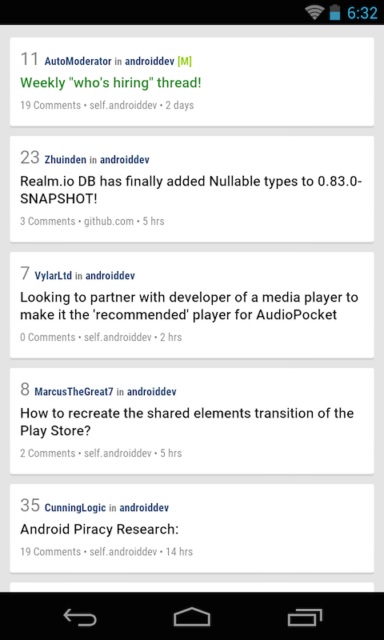
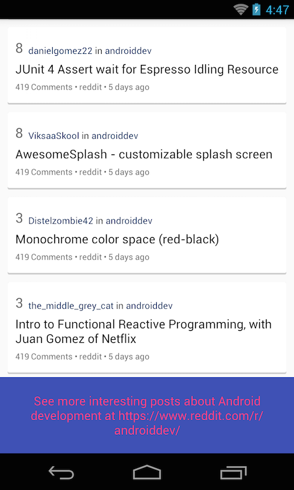

# ListView
______
## Objectives:
* Learn how to use ListView to display a list of data.

## Requirements:
* Clone the initial code at: https://github.com/jupitervn/Android_AreYouAndroidDev/tree/master
* Display a list of posts with the UI below:

* Each post item will show the post's score, title, author, no of comments, domain of the post.
* Sticky post will have green-colored(`#387801`) title.
* Author name and subreddit name should have dark blue color (`#0A295A`)
* Click on post item will open another activity `PostViewActivity` that contains a webview and show the post content.
* Add a view at the bottom of the list that shows the following message, click on that view will also open `PostViewActivity` with this link: https://www.reddit.com/r/androiddev/

## References:
* How to use listview:  http://www.vogella.com/tutorials/AndroidListView/article.html
* Webview: http://developer.android.com/intl/zh-cn/reference/android/webkit/WebView.html

## Bonus:
* See if you can increase the space between items inside the list.
* Can you display post's author and post's subreddit using only one textview?
