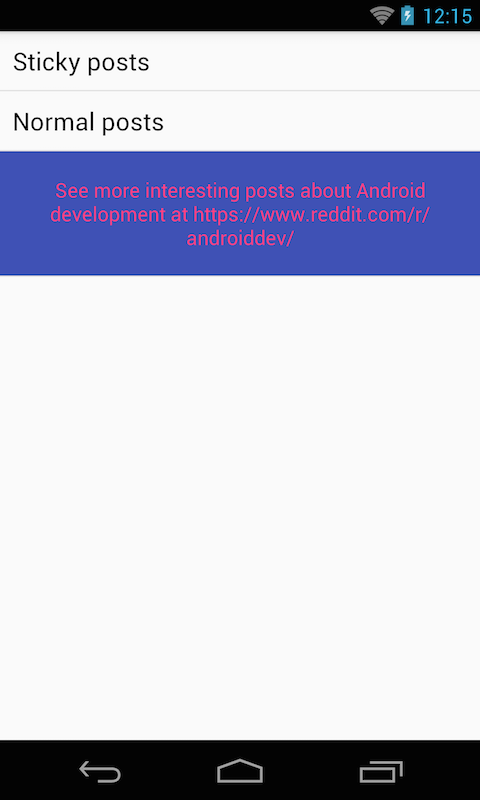
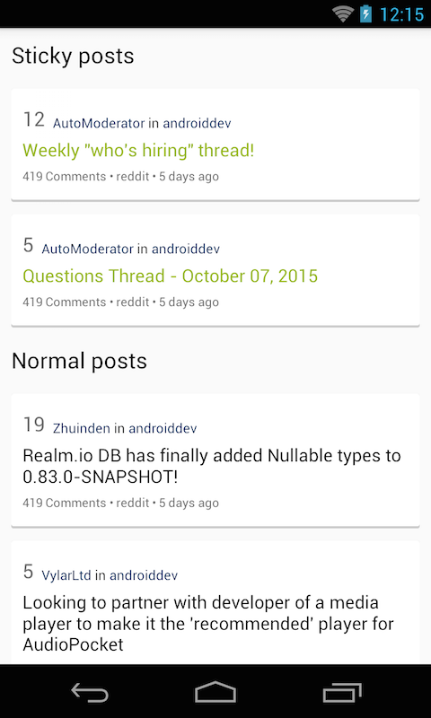

## Objectives:
* What if we want to group posts into sections?

## Requirements:
* Implements `PostInSectionActivity` to group sticky posts and normal posts into two sections.
* UI should look like this:

* Tap on section will expand/collapse a list of posts belongs to that section.

## References:
* ExpandableListView: http://developer.android.com/intl/zh-cn/reference/android/widget/ExpandableListView.html
* ExpandableListView tutorial: http://www.androidhive.info/2013/07/android-expandable-list-view-tutorial/

## Bonus:
* See if you can implement this feature with ListView and multiple view types.
