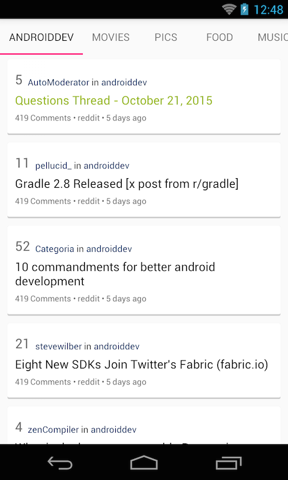

## Objectives:
* Learn how to create a layout with tabs.

## Requirements:
* User don't want to read only one topics.
* Modify the previous app in [Exercise 7.1](Exercise_7_1_New_Datasource) to display more topics.
* List of supported topics would be:
    + `androiddev`: https://www.reddit.com/r/androiddev/hot.json
    + `movies`: https://www.reddit.com/r/movies/hot.json
    + `pics`: https://www.reddit.com/r/pics/
    + `food`: https://www.reddit.com/r/food/hot.json
    + `music`: https://www.reddit.com/r/Music/hot.json
    + `comic`: https://www.reddit.com/r/comics/hot.json
* The UI should be implemented as following:

## References:
* How to use `TabLayout`: https://guides.codepath.com/android/Google-Play-Style-Tabs-using-TabLayout

## Bonus:
* Try both modes of the tab layout.
* Try to add an icon for each tab.
* See if you can include `ViewPager` and provides swipe action to select tabs.
