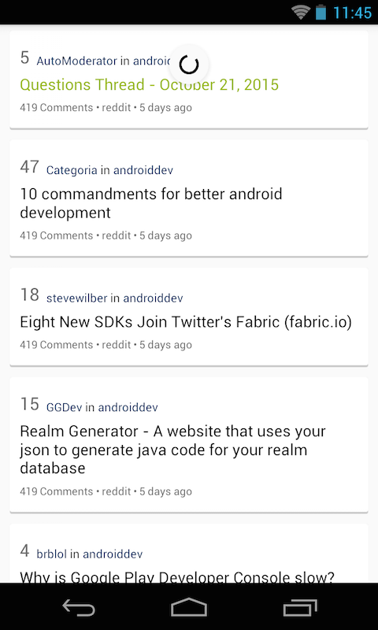
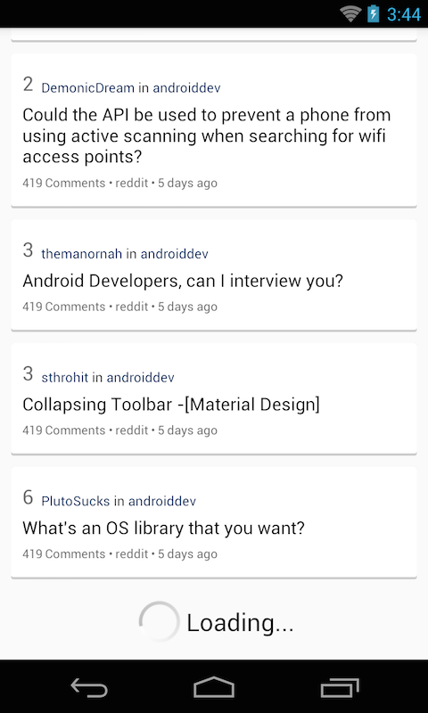

## Objectives:
* Learn how to make HTTP request, get response, parse the response and display the data in UI.
> Should know what are supported methods for a HTTP request, what is RESTful API, json, xml...
* Network operation should be run on another thread out of main thread to prevent UI blocking
> Use your knowledge about threads and processes to do this.

## Requirements:
* Level up your app from [Exercise 2.1](Exercise_2_1_List_everything_out)
* Use `reddit` API to get reddit posts instead of read from local json file.
* The documentation for `reddit` API is located at: https://www.reddit.com/dev/api
* The API we will use is: https://www.reddit.com/r/androiddev/new.json
> Please notice how to get more posts by using `after` parameter.

* Implements another class called `NetworkBasedFeedDataStore` to make HTTP request and get reddit posts. (The skeleton code for this class can be found here: [NetworkBasedFeedDataStore](https://github.com/jupitervn/Android_AreYouAndroidDev/blob/master_network_calls/app/src/main/java/com/hasbrain/areyouandroiddev/datastore/NetworkBasedFeedDatastore.java))
* There will be a delay while waiting for the request to be made, please use `SwipeRefreshLayout` to show a loading indicator and provides `pull to refresh` action.
> Pull to refresh is an action when user pulls down on the list, the data will be refreshed with the latest one.

* Loading indicator should be hidden after data has been pulled and displayed on UI.
* Users always want to read a lot, so developer would provides a way to load more posts for them.
    + When user scrolls to the end of the list, call the API to get more posts.
    + Show a loading indicator similar to the screenshot below while loading and replace it by new data when complete.

* If the network call for the first page has failed (by multiple reasons): please show a UI like this:

* When user pull to refresh, what is currently displayed on the UI will be discarded and user will see the first page of posts again.

## References:
* Synchronous vs Asynchronous: http://www.javatpoint.com/understanding-synchronous-vs-asynchronous
*  Basic about HTTP: http://www.tutorialspoint.com/http/index.htm
* How to connect and make a HTTP request: http://developer.android.com/training/basics/network-ops/connecting.html
* How to use Volley: http://developer.android.com/training/volley/index.html
* Some other network libraries:
    + OkHttp: http://square.github.io/okhttp/
    + Retrofit 1.x: https://guides.codepath.com/android/Consuming-APIs-with-Retrofit
    + Ion: https://github.com/koush/ion
* How to use `SwipeRefreshLayout`: http://antonioleiva.com/swiperefreshlayout/
