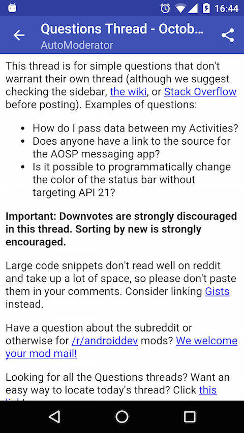
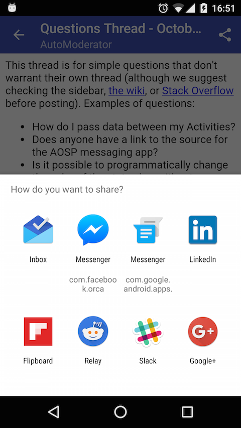

## Objectives:
* Learn how to add more UI components to your app: Menu, Toolbar, Dialog...

## Requirements:
* Implements a post detail page (the activity should be named `PostDetailActivity`) to display a Reddit post instead of using webview.
* Modify the previous app at [Exercise 6.1](Exercise_6_1_New_Datasource.md)
    + Include `selftext` inside `RedditPost` model to get the post's content.
    + Fix parser to parse `selftext_html` from the API response.
* The UI should look like below:

* How to display post content:
    + If post contains `selftext_html` then display the content of `selftext_html`.
    + Else display the content of the post's `url`.
    + While the post's content is loading, should show a progress dialog like below:
    
* The post's title is displayed as title of the action bar.
* The post's author is displayed as subtitle of the action bar.
* Tapping on the back arrow should close the activity.
* Tapping on share icon should open a list of apps that can provide share function for the post's url.

## References
* How to use actionbar: http://developer.android.com/guide/topics/ui/actionbar.html
* Themes and styles:
    + http://developer.android.com/guide/topics/ui/themes.html
    + https://github.com/codepath/android_guides/wiki/Styles-and-Themes
* How to style an action bar: https://guides.codepath.com/android/Extended-ActionBar-Guide

## Bonus:
* Can you use `Toolbar` to act as `ActionBar`? http://www.vogella.com/tutorials/AndroidActionBar/article.html
