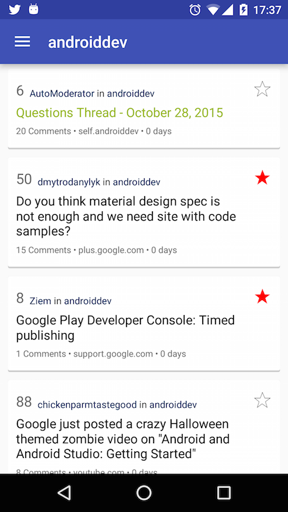
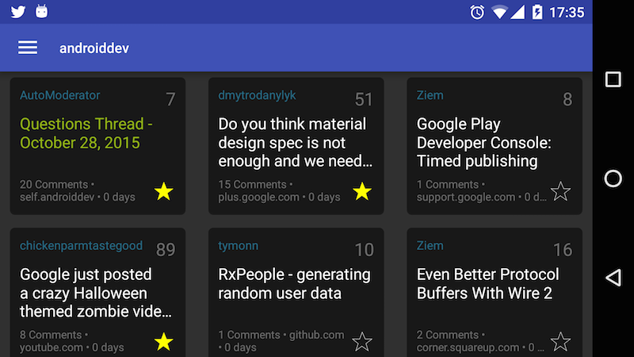
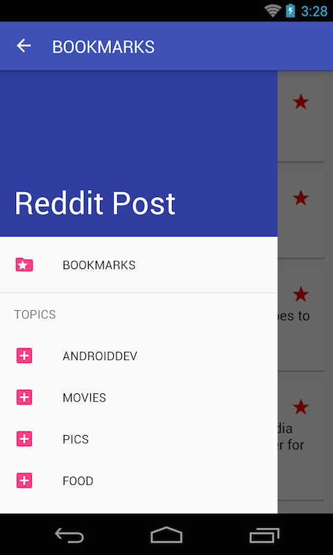
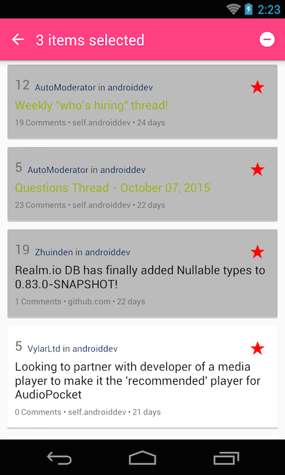
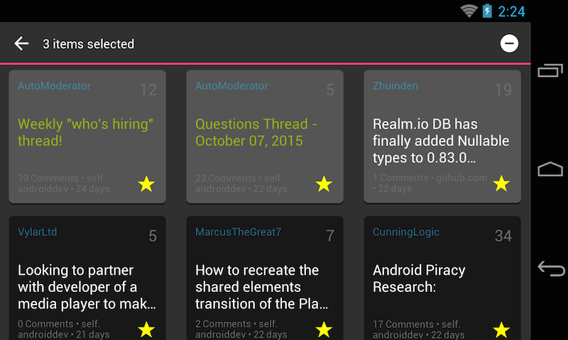

## Objectives
* Learn how to provide users a contextual menu.

## Requirements
* Use the existing code from [Exercise 7.2](Exercise_7_2_Navigation_Drawer.md).
* Modify the layout to include a button to bookmark a post. You can choose your own way to store bookmarked posts.
> Colored star icon indicates that a post is bookmarked.

* Add the `Bookmark` menu to the navigation drawer.

* Choose `Bookmark` menu will open a page that list all the bookmarked posts.
* Long press on an item inside `Bookmark` page will trigger the contextual menu like this:

* Tap on the `remove` icon will delete all the selected posts from bookmark.
* All the icons can be downloaded from here (this is the `xxxhdpi` you can resize for other screensizes if needed)
    +  
    + 
    + 

## References
* How to add a contextual menu: http://developer.android.com/guide/topics/ui/menus.html#context-menu

## Bonus:
* `Listview` already has a way to handle contextual menu for you, can you find out the way to do that?
* Find a way to make contextual Menu work with `Toolbar`.
