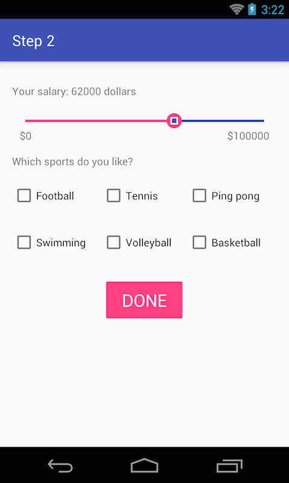
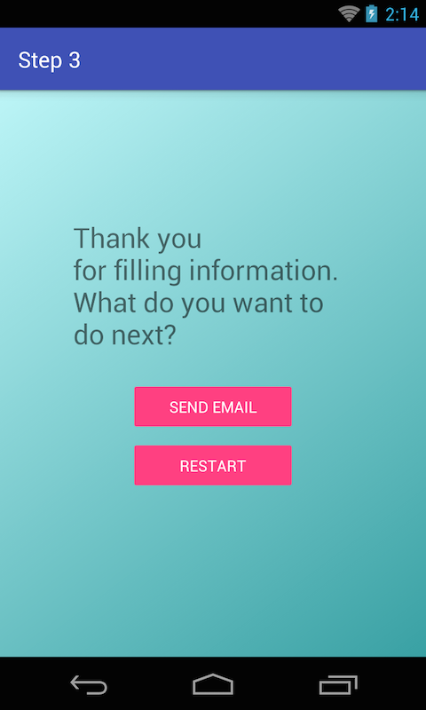

## Objectives
* Learn how to work with drawables and which type of drawables Android supports.

## Requirements
Read the documents at the References section and do the followings tasks:
* Customize the seek bar in `Step 2` UI of the [Exercise 1.2](Exercise_1_1_Layout_and_UI_controls.md).



* Set a drawable with gradient same as below (startColor `#39a1a4`, endColor `#bcf5f7`)



## References
* [Android Drawables](http://developer.android.com/guide/topics/resources/drawable-resource.html)
* [Drawable Guide] (https://github.com/codepath/android_guides/wiki/Drawables)
* Sample progress drawable from Google

```
<?xml version="1.0" encoding="utf-8"?>
<!-- Copyright (C) 2008 The Android Open Source Project

     Licensed under the Apache License, Version 2.0 (the "License");
     you may not use this file except in compliance with the License.
     You may obtain a copy of the License at

          http://www.apache.org/licenses/LICENSE-2.0

     Unless required by applicable law or agreed to in writing, software
     distributed under the License is distributed on an "AS IS" BASIS,
     WITHOUT WARRANTIES OR CONDITIONS OF ANY KIND, either express or implied.
     See the License for the specific language governing permissions and
     limitations under the License.
-->

<layer-list xmlns:android="http://schemas.android.com/apk/res/android">

    <item android:id="@android:id/background">
        <shape>
            <corners android:radius="5dip" />
            <gradient
                    android:startColor="#ff9d9e9d"
                    android:centerColor="#ff5a5d5a"
                    android:centerY="0.75"
                    android:endColor="#ff747674"
                    android:angle="270"
            />
        </shape>
    </item>

    <item android:id="@android:id/secondaryProgress">
        <clip>
            <shape>
                <corners android:radius="5dip" />
                <gradient
                        android:startColor="#80ffd300"
                        android:centerColor="#80ffb600"
                        android:centerY="0.75"
                        android:endColor="#a0ffcb00"
                        android:angle="270"
                />
            </shape>
        </clip>
    </item>

    <item android:id="@android:id/progress">
        <clip>
            <shape>
                <corners android:radius="5dip" />
                <gradient
                        android:startColor="#ffffd300"
                        android:centerColor="#ffffb600"
                        android:centerY="0.75"
                        android:endColor="#ffffcb00"
                        android:angle="270"
                />
            </shape>
        </clip>
    </item>

</layer-list>


```

## Bonus
* Try to draw list item's background from previous exercises using code.
