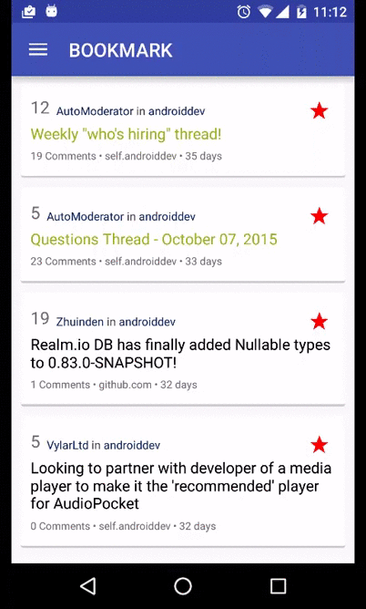

## Objectives
* Learn more animations that are introduced in Lollipop.

## Requirements
* All the animations below can only be used with Android >= 21.

#### Ripple Effect
* Enhance your app from [Exercise 6.1](Exercise_6_1_New_Datasource.md)
* Add the following animation when press/long press on a reddit post item.

#### Shared Element Animation
* Add the following animation to [Exercise 5.2](Exercise_5_2_List_of_images.md)
> Notice how car's image and car's title is animated.

## References
* Learn how to use card view: https://guides.codepath.com/android/Using-the-CardView
* Material designs principles: http://www.google.com/design/spec/material-design/introduction.html
* Ripple Effect: https://blog.stylingandroid.com/ripples-part-1/
* Circular reveal effect
* Shared element screen transition: https://guides.codepath.com/android/Shared-Element-Activity-Transition
