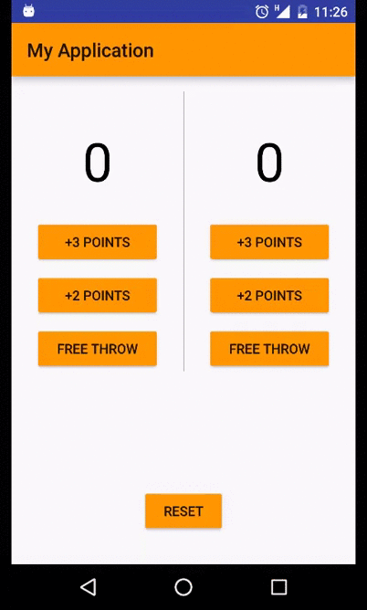
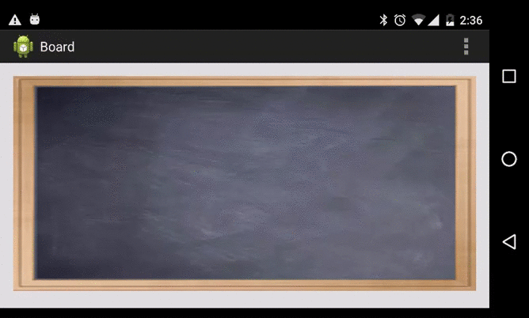

##Objectives
* Learn how to write a custom view.

## Requirements
There are two kinds to implement a custom view: use a compound view or extends a normal view.

#### Compound view
* Build this simple app using compound view.

#### Custom view
* Write an app to simulating drawing on a chalk board.

> The image for the board background can be found [here](chalkboard.png)

## References
*  http://developer.android.com/guide/topics/ui/custom-components.html
* http://developer.android.com/training/custom-views/index.html

## Bonus
* What the difference between `<merge/>` and `<include/>` xml tag?
